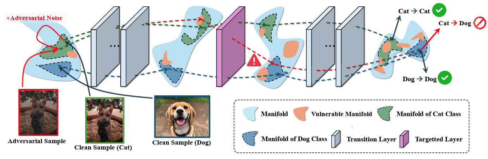
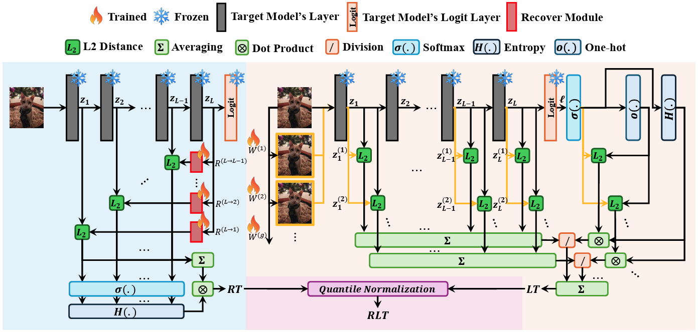

# A Few Large Shifts (AFLS) Assumption-based Adversarial Examples (AEs) Detection

[](https://arxiv.org/abs/2505.12586)   []()

> [**A Few Large Shifts: Layer-Inconsistency Based Minimal Overhead Adversarial Example Detection**](https://arxiv.org/abs/2505.12586)  
> Sanggeon Yun, Ryozo Masukawa, Hyunwoo Oh, Nathaniel D. Bastian, Mohsen Imani  
> *arXiv:2505.12586*  


<p align="center"><em>Figure&nbsp;1. Illustration of the A&nbsp;Few Large Shifts (AFLS) assumption.</em> </p>

A lightweight, plug-in detection framework that leverages internal layer-wise inconsistencies of a frozen classifier to detect adversarial examples--is self-sufficient (no adversarial examples), model-local (no external pre-trained models such as SSL), and low-overhead (no complex structures such as kNN graphs to maintain reference sets or excessive augmentations), making it ideal for scalable deployment.


<p align="center"><em>Figure&nbsp;2. Recovery Testing (RT) and Logit‑layer Testing (LT) are fused into RLT via quantile normalisation.</em></p>

---

## 📁 Repository Structure

```
├── src
│   ├── backbone_trained
│   │   └── ResNet110_CIFAR10.pt      # Pre-trained ResNet-110 on CIFAR-10
│   ├── iGAT                          # AutoAttack (iGAT) implementation
│   ├── attacks.py                   # Wrappers for FGSM, PGD, AutoAttack, CW, Square
│   ├── backbone.py                  # Dynamic backbone loader (timm, TorchHub, custom)
│   ├── config.py                    # MODEL_SETTINGS, BACKBONES, DATASETS, ATTACKS
│   ├── data.py                      # Dataset loaders & transforms
│   ├── model.py                     # ModelWrapper (hooks) & Tester (recovery & masks)
│   ├── resnet.py                    # ResNet-110 implementation
│   ├── train.py                     # Training, evaluation, robustness & detection loop
│   └── utils.py                     # Utilities (e.g., compute_auc)
├── requirements.txt                 # Python dependencies
└── README.md                        # You are here
```

---

## 🚀 Quickstart

### 1. Clone the repo

```bash
git clone https://github.com/c0510gy/AFLS-AED.git
cd AFLS-AED
```


### 2. Install dependencies

```bash
pip install -r requirements.txt
```

### 3. Run training & detection evaluation

```bash
cd src
python train.py \
  --dataset cifar10 \
  --arch resnet110 \
  --data_dir ./data \
  --batch_size 64 \
  --epochs 100 \
  --lr 1e-4 \
  --wd 1e-2 \
  --attacks FGSM PGD AutoAttack Square
```

### Outputs

- Clean train/test accuracy
- For each attack: robust accuracy, RT-AUC, LT-AUC, RLT-AUC
- Cached adversarial samples in `attack_samples_{dataset}_{arch}_{attack}.pt`

---

## 🔧 Supported Configurations

### Backbones

- ResNet-18, ResNet-110, DenseNet-121, ShuffleNetV2_x1_0, MobileNetV2_x0_5, RepVGG_A0

### Datasets
- CIFAR-10, CIFAR-100, ImageNet

### Attacks

- **Supported**  
  - FGSM (via [foolbox](https://github.com/bethgelab/foolbox))
  - PGD (via [foolbox](https://github.com/bethgelab/foolbox))
  - AutoAttack (via [iGAT](https://github.com/xqsi/iGAT))
  - Square Attack (via [iGAT](https://github.com/xqsi/iGAT))

- **CW Attack**: CW adversarial examples are generated using an external library and are not combined in this repository.

---

## ⚙️ Customizing Detection

By default, recovery/testing modules use:

```py
MODEL_SETTINGS = {
  "num_aug":   4,    # number of learned masks (G)
  "recov_dim": 128,  # hidden dim of each adapter
  "recov_depth": 4,  # layers in each MLP
}
```

Override via CLI:

```bash
cd src
python train.py \
  --num_aug 6 \
  --recov_dim 256 \
  --recov_depth 5 \
  [other args...]
```


---

## 📝 Usage Examples

- CIFAR-10 + ResNet-110
```bash
python train.py --dataset cifar10 --arch resnet110
```
- CIFAR-100 + ResNet-18
```bash
python train.py --dataset cifar100 --arch resnet18
```
- CIFAR-100 + ShuffleNetV2
```bash
python train.py --dataset cifar100 --arch shufflenetv2_x1_0
```
- CIFAR-100 + MobileNetV2
```bash
python train.py --dataset cifar100 --arch mobilenetv2_x0_5
```
- CIFAR-100 + RepVGG
```bash
python train.py --dataset cifar100 --arch repvgg_a0
```
- 	ImageNet + DenseNet-121
(Set --ata_dir to your ImageNet path)
```bash
python train.py --dataset imagenet --arch densenet121 --data_dir /path/to/imagenet --recov_depth 3 --train_break True
```

---

## 🔍 Code Highlights

- **attacks.py**: High-level wrappers for FGSM, PGD, CW, Square Attack and AutoAttack (foolbox, iGAT).
- **backbone.py**: Unified interface for loading models from timm, TorchHub, or custom implementations.
- **model.py**
	- **ModelWrapper**: Hooks into intermediate layers to extract activations.
	- **Tester**: Implements Recovery Testing (RT) and Logit-layer Testing (LT).
- **train.py** Orchestrates:
	1.	Training of recover modules & augmentation matrices
	2.	Robustness evaluation
	3.	Detection AUC computation
- **utils.py**: Helper functions (e.g., compute_auc for ROC-AUC).

---

## 📚 References

If you find our work useful, please cite:

```bibtex
@article{yun2025few,
  title={A Few Large Shifts: Layer-Inconsistency Based Minimal Overhead Adversarial Example Detection},
  author={Yun, Sanggeon and Masukawa, Ryozo and Oh, Hyunwoo and Bastian, Nathaniel D and Imani, Mohsen},
  journal={arXiv preprint arXiv:2505.12586},
  year={2025}
}
```
